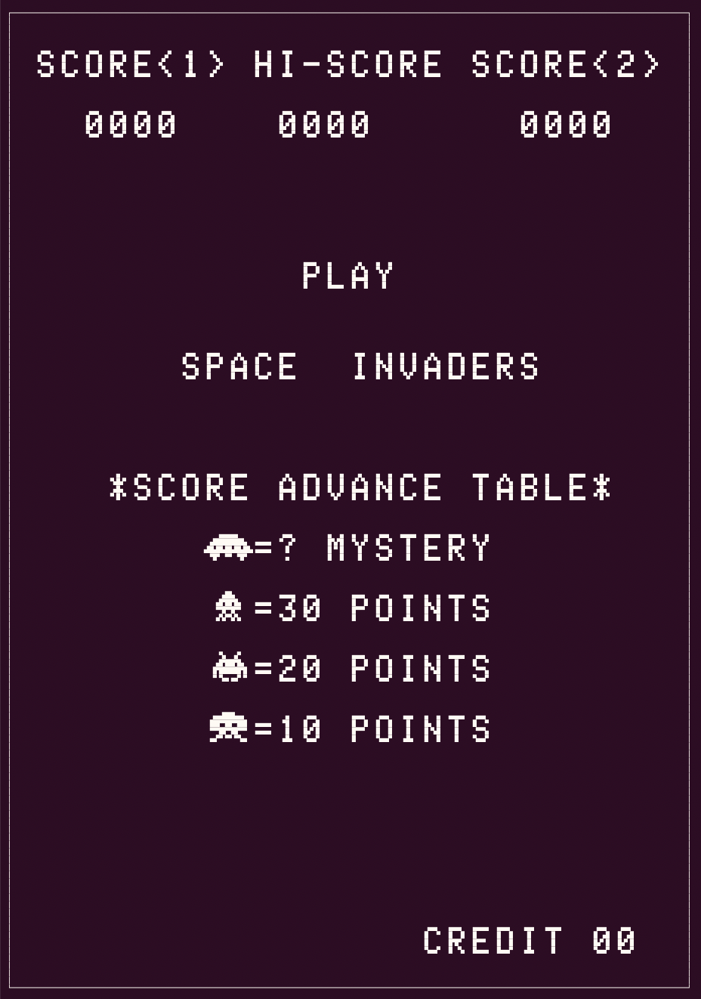

# 8080_emulator

A simple 8080 emulator made with the goal of emulating space invaders. Based on and inspired by the guide at [emulator101](http://emulator101.com/).



## Launch the emulator

The Space Invader ROM files are omitted due to copyright. To run the emulator, add the `invaders.[e,f,g,h]` files to the `ROM` directory at the root of the project.

### Compile

```
gcc -g -O0 8080_main.c -o 8080_main
```

### Run

The emulator takes in an optional parameters for verbosity and to specify the number of instructions to execute.

```
./8080_main [<verbose>] [<stop_at>]
```

## Notes

### Disassembler

Each instruction handler is defined using one of the `INSTR` macros, which handle the various instruction formats. Then, each instruction handler is added to `disasm_handlers`, at their respective opcode index.

### Emulator

Like the disassembler, the emulation handlers are added to the `emu_handlers`, indexed by opcode. Common functionalities are moved into seperate functions to avoid code duplication. Unless explicitly mentioned, instructions _do not_ affect flags.

#### Flags

- Zero: if result of instruction has the value 0, flag is set; otherwise it is reset.
- Sign: if the most significant bit of the result of the operation has value 1, this flag is set; otherwise it is reset.
- Parity: if the module 2 sum of the bits of the result of the operation is 0, (i.e. result has even parity), this flag is set; otherwise it is reset.
- Carry: If the instruction results in a carry (from addition), or a borrow  (from subtraction or comparison) out of the high-order bit, this flag is set, otherwise it is reset.
- Auxiliary Carry: If the instruction caused a carry out of bit 3 and into bit 4 of the resulting value, the auxiliary carry is set; otherwise it is reset. This flag is affected by single precision additions, subtractions, increments, decrements, comparisons, and logical operations, but is principally used with additions and increments preceding a DAA (Decimal Adjust Accumulator) instruction.

### Goals

- [x] Full 8080 instruction disassembly
- [x] Full 8080 instruction emulation
- [x] Draw graphics
- [ ] Proper machine timing (slow down to 2MHz)
    - [ ] Use correct number of cycles per instruction
- [ ] I/O
    - [x] Shift register hardware (Write ports 2 & 4, Read port 3)
    - [ ] Player input
- [ ] Sounds

## References
[Intel 8080 Microcomputer Systems User's Manual, September 1975](http://www.nj7p.info/Manuals/PDFs/Intel/9800153B.pdf)
[ComputerArcheology Space Invaders Hardware Overview](http://computerarcheology.com/Arcade/SpaceInvaders/Hardware.html)
